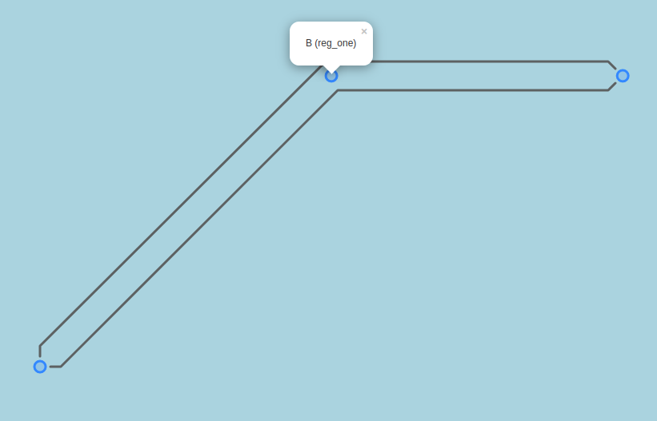
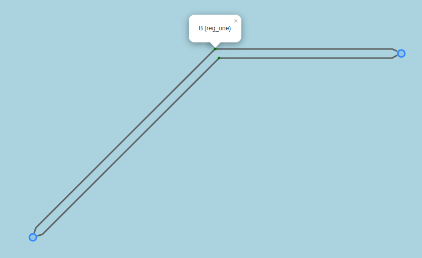

# geolineo

Server that generates a geojson representation optimized to visualize power grids. 
Lines are rendered to routes and the placement of the lines can be controlled.




# Input data
Format input data:

```json
{
  "locations": [ ...  ],
  "routes": [ ... ],
  "mapping": [ ... ],
  "unique_lines": [ ... ],
  "parameter": {
    "line_dist": 0.05,
    "kink_dist": 0.05
  },
  "connected_lines": [ ... ]
}
```

location data format:
```json
    {
      "guid": "guid_loc_A",
      "ll": { "lat": 0, "lng": 0 },
      "hidden": false,
      "properties": {
        "name": "A",
        "region": "reg_one"
      }
    }
```

routes data format:
```json
    {
      "guid": "guid_r_1",
      "loc_startend_mrid": ["guid_loc_B", "guid_loc_A"],
      "route_points":[{"lat": 0.5, "lng": 1.0 }, {"lat": 1.0, "lng": 0.5}, {"lat": 0.0, "lng": 0.0}]
    }
```

...

## Example
```json
{
  "locations": [
    {
      "guid": "guid_loc_A",
      "ll": {"lat": 0, "lng": 0},
      "hidden": false,
      "properties": {
        "name": "A",
        "region": "reg_one"
      }
    },
    {
      "guid": "guid_loc_B",
      "ll": {"lat": 0.5, "lng": 1},
      "hidden": false,
      "properties": {
        "name": "B",
        "region": "reg_one"
      }
    },
    {
      "guid": "guid_loc_C",
      "ll": {"lat": 1, "lng": 1.5},
      "hidden": false,
      "properties": {"name": "C", "region": "reg_one"}
    },
    {
      "guid": "guid_loc_D",
      "ll": {"lat": 2, "lng": 2},
      "hidden": false,
      "properties": { "name": "D", "region": "reg_two"}
    }
  ],
  "routes": [
    {
      "guid": "guid_r_1",
      "loc_startend_mrid": ["guid_loc_B", "guid_loc_A"],
      "route_points":[{"lat": 0.5, "lng": 1.0 }, {"lat": 1.0, "lng": 0.5}, {"lat": 0.0, "lng": 0.0}]
    },
    {
      "guid": "guid_r_2",
      "loc_startend_mrid": ["guid_loc_B", "guid_loc_C"],
      "route_points":[{"lat": 0.5, "lng": 1.0 }, {"lat": 1.0, "lng": 1.5}]
    }
  ],
  "mapping": [
    {
      "line_mrid": "guid_ul_1",
      "route_mrid": "guid_r_2",
      "shift_orth": 0,
      "order": 1,
      "invert_direction": false
    },
    {
      "line_mrid": "guid_ul_1",
      "route_mrid": "guid_r_1",
      "shift_orth": 0,
      "order": 0,
      "invert_direction": true
    }
  ],
  "unique_lines": [
    {
      "guid": "guid_ul_1",
      "loc_startend_mrid": ["guid_loc_A", "guid_loc_C"],
      "parameter": {"name": "UL1"}
    },
    {
      "guid": "guid_ul_2",
      "loc_startend_mrid": ["guid_loc_D", "guid_loc_C"],
      "parameter": {"name": "UL2"}
    },
    {
      "guid": "guid_ul_3",
      "loc_startend_mrid": ["guid_loc_C", "guid_loc_D"],
      "parameter": {"name": "UL3"}
    }
  ],
  "parameter": { "line_dist": 0.05, "kink_dist": 0.05 },
  "connected_lines": []
}
```

# Render 

To render the data, the input data in the above described format need to be uploaded with a post request.
The response is the rendered geo-json. The endpoint is
```url
/api/v1/render
```

Example:
```bash
curl -X POST -H "Content-Type: application/json" -d @in.json http://127.0.0.1:8000/api/v1/render
```